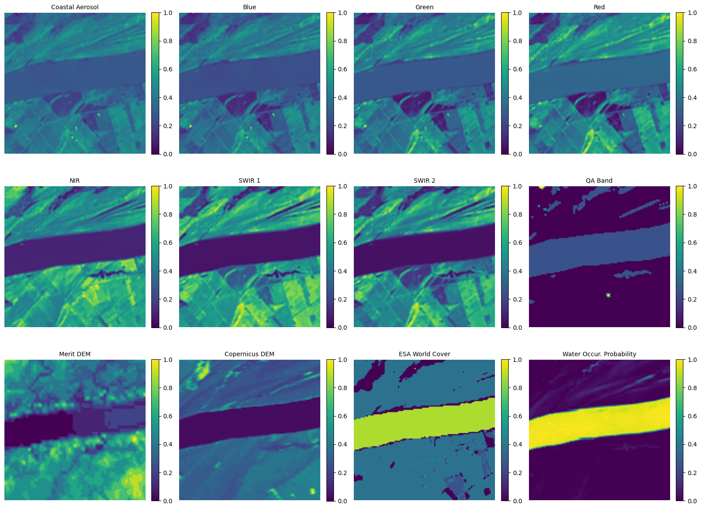

# Multispectral Water Body Segmentation
---

## Dataset Structure

The dataset comprises harmonized satellite tiles paired with corresponding binary ground-truth labels. The structural parameters of this dataset layout are defined as follows:

* **Spatial and Ground Resolution:** 
  * **Patch Size:** $128 \times 128$ pixels.
* **Format:** 
  * **Images:** Multichannel `.tif` (TIFF) format containing 12 coincident spectral, elevation, and probability layers.
  * **Labels:** Companion `.png` files containing binary masks where background/land is encoded as `0` and water bodies are encoded as `1` (or `255`, mapped to `1` during preprocessing).

### The 12-Channel Band Layout
Rather than relying solely on visible light (RGB), this dataset appends physical, environmental, and historical layers into a unified 12-channel stack:

| Channel Index | Band Name | Spectral / Data Range | Primary Function in Water Detection |
| :---: | :--- | :--- | :--- |
| **1** | Coastal Aerosol | $\sim 430\text{–}450\text{ nm}$ | High sensitivity to aerosols and suspended river sediment; corrects atmospheric scattering. |
| **2** | Blue | $\sim 450\text{–}510\text{ nm}$ | Penetrates water columns; useful for identifying clear shallow water. |
| **3** | Green | $\sim 530\text{–}590\text{ nm}$ | High reflectance over algae, or sediment-heavy waters. |
| **4** | Red | $\sim 640\text{–}670\text{ nm}$ | Helps inBoundary Visualization; creating a transition point where water absorption begins to increase. |
| **5** | NIR (Near-Infrared) | $\sim 850\text{–}880\text{ nm}$ | Strongly absorbed by water; highly reflected by vegetation. Creates a stark land-water boundary. |
| **6** | SWIR 1 | $\sim 1570\text{–}1650\text{ nm}$ | Strong absorption by moisture; highly effective for distinguishing wet soils from open water. |
| **7** | SWIR 2 | $\sim 2110\text{–}2290\text{ nm}$ | Peak water absorption; crucial for separating shallow shorelines from muddy shore banks. |
| **8** | QA Band | Discrete Flags | Identifies anomaly pixels (cloud, cloud shadow, snow). |
| **9** | Merit DEM | Elevation (m) | Global topographic model; constrains water to low-lying basins. |
| **10** | Copernicus DEM | Elevation (m) | High-accuracy local surface model; provides local slope directions. |
| **11** | ESA World Cover | Categorical Land Cover | Provides global thematic classification priors (e.g., forest, urban, agricultural, water). |
| **12** | Water Occur. Prob. | Probability ($0\text{–}100\%$) | Historical surface water presence probability maps |

---

Band-by-Band Visual Example

The visual outputs generated from the 12-band sample slice reveal a large river running horizontally through the scene. Examining each band cohort normalized to $[0.0, 1.0]$ illustrates the distinct information provided by each sensor group:

### 1. Visible Bands (Coastal Aerosol, Blue, Green, Red)
* **Visual Signature:** The river channel appears as a dark, low-contrast band relative to the surrounding land features.
* **Analysis:** Because visible light partially reflects off suspended sediment and the river bottom, water does not appear completely black here. The surrounding land shows complex, heterogeneous agricultural field patterns. The green and red bands exhibit high variance over land due to different vegetation stages and soil types, which can occasionally confuse simple classification models.

### 2. Infrared Bands (NIR, SWIR 1, SWIR 2)
* **Visual Signature:** The river channel transitions into a sharp, uniformly dark purple stripe ($0.0$ reflectance), contrasting against the highly reflective yellow and green land features.
* **Analysis:** Since water molecules strongly absorb electromagnetic radiation in the infrared wavelengths, the river acts as a near-perfect energy sink. NIR is highly sensitive to leaf structure (making healthy vegetation bright), while SWIR bands are sensitive to soil moisture. Together, they create a high-contrast boundary at the land-water interface.

### 3. Quality Assessment (QA Band)
* **Visual Signature:** A blocky, semi-discrete thematic visualization showing uniform values with isolated anomalies.
* **Analysis:** This layer serves as a mask to notify the model of obscured pixels. In this sample, the uniform values signify clear sky conditions, while the tiny bright pixel near the lower center indicates a minor localized artifact or sensor anomaly.

### 4. Topographical Layers (Merit DEM and Copernicus DEM)
* **Visual Signature:** The river channel is visible as a deep, low-elevation depression (dark purple) slicing through the surrounding higher-elevation green/yellow terrain.
* **Analysis:** 
  * **Merit DEM** exhibits a coarser pattern because of its generalized, regional vertical smoothing.
  * **Copernicus DEM** displays much higher localized resolution, highlighting fine-scale drainage channels, embankments, and topographic changes. Since water gathers at the local minimum elevation, these layers prevent models from misidentifying dark mountain shadows as water.

### 5. Derived and Historical Priors (ESA World Cover & Water Occurrence Probability)
* **Visual Signature:**
  * **ESA World Cover:** Displays a bright yellow, highly distinct classification band mapping directly to the river's path, set against dark purple background land-cover classes.
  * **Water Occurrence Probability:** A sharp, continuous yellow stripe indicating a near-$100\%$ ($1.0$) historic water occurrence rate.
* **Analysis:** These channels act as historical and context-based priors. While the spectral bands vary dynamically due to weather, seasonal flooding, or turbidity, these auxiliary layers anchor the neural network's predictions using long-term global observation data.

---

### Normalized Band Visualization

